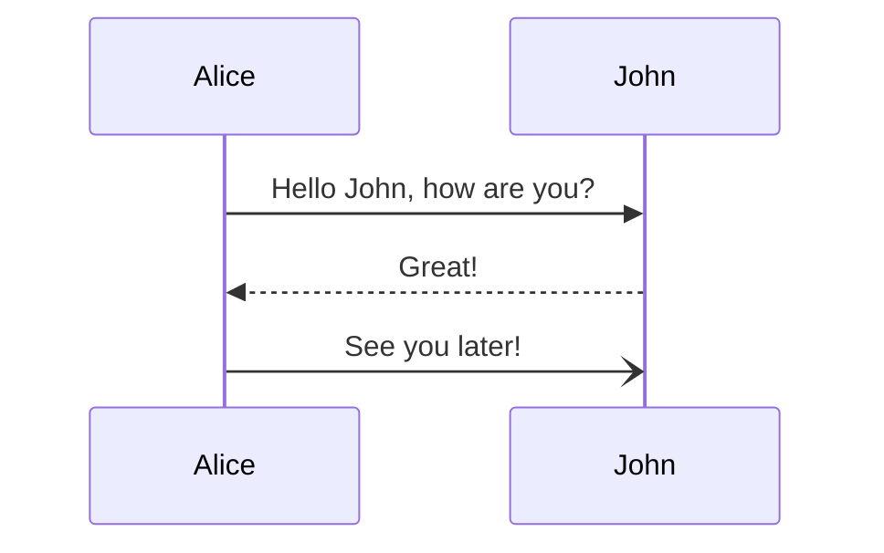
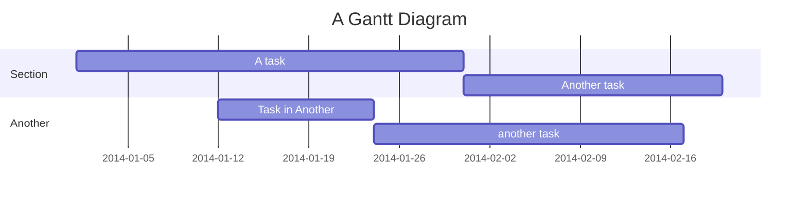

# 试试如何

```python
print("hello world")
```

- 可以
	- 不错
	- 123123
- **test**
	- ==223213==
	- *321323*



```mermaid
sequenceDiagram
    Alice->>John: Hello John, how are you?
    John-->>Alice: Great!
    Alice-)John: See you later!

```



```mermaid
gantt
    title A Gantt Diagram
    dateFormat YYYY-MM-DD
    section Section
        A task          :a1, 2014-01-01, 30d
        Another task    :after a1, 20d
    section Another
        Task in Another :2014-01-12, 12d
        another task    :24d

```

### callout
>[!note]  test
> 123123123

